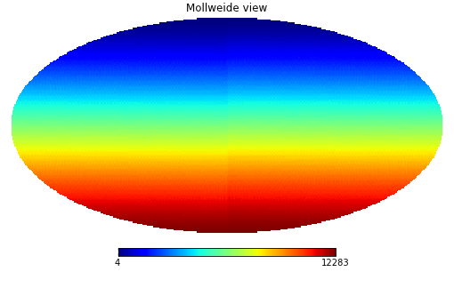
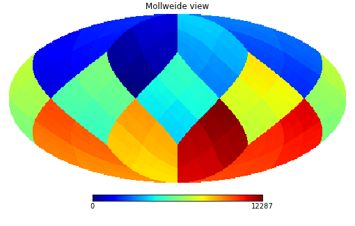
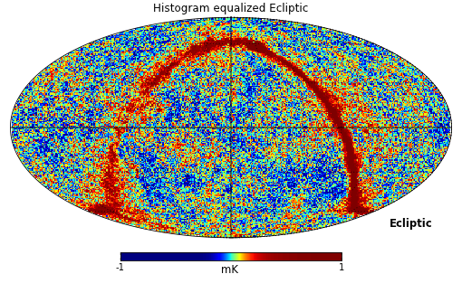
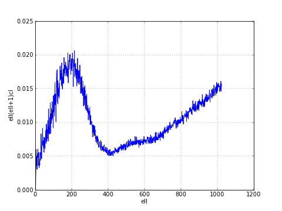

Healpy tutorial
=================

Creating and manipulating maps
------------------------------

Maps are simply numpy arrays, each array element refers to a location in the sky as defined by the Healpix pixelization schemes, see the `healpix website`_.

The resolution of the map is defined by the *NSIDE* parameter, the :py:func:`~healpy.pixelfunc.nside2npix` function gives the number of pixel *NPIX* of the map:

>>> import numpy as np
>>> import healpy as hp
>>> NSIDE = 32
>>> m = np.arange(hp.nside2npix(NSIDE))
>>> hp.mollview(m, title="Mollview image RING")

Healpix supports two different ordering schemes, *RING* or *NESTED*, **by default healpy maps are in *RING* ordering**.

In order to work with *NESTED* ordering, all map related functions support the `nest` keyword, for example:

>>> hp.mollview(m, nest=True, title="Mollview image NESTED")

.. _healpix website: http://healpix.jpl.nasa.gov

Reading and writing maps to file
--------------------------------

Maps are read with the :py:func:`~healpy.fitsfunc.read_map` function:

>>> wmap_map_I = hp.read_map('../healpy/test/data/wmap_band_imap_r9_7yr_W_v4.fits')

by default input maps are **converted to *RING* ordering**, if they are in *NESTED* ordering. You can otherwise specify `nest=True` to retrieve a map is NESTED ordering, or `nest=None` to keep the ordering unchanged.

By default :py:func:`~healpy.fitsfunc.read_map` loads the first column, for reading other columns you can specify the `field` keyword. 

:py:func:`~healpy.fitsfunc.write_map` writes a map to disk in FITS format, if the input map is a list of 3 maps, they are written to a single file as I,Q,U polarization components:

>>> hp.write_map("my_map.fits", wmap_map_I)

Visualization
-------------

Mollweide projection with :py:func:`~healpy.visufunc.mollview` is the most common visualization tool for HEALPIX maps, it supports also coordinate transformation:

>>> hp.mollview(wmap_map_I, coord=['G','E'], title='Histogram equalized Ecliptic', unit='mK', norm='hist', min=-1,max=1, xsize=2000) 
>>> hp.graticule()

`coord` does galactic to ecliptic coordinate transformation, `norm='hist'` sets a histogram equalized color scale and `xsize` increases the size of the image. :py:func:`~healpy.visufunc.graticule` adds meridians and parallels.

:py:func:`~healpy.visufunc.gnomview` instead provides gnomonic projection around a position specified by `rot`:

>>> hp.gnomview(wmap_map_I, rot=[0,0.3], title='GnomView', unit='mK', format='%.2g')

shows a projection of the galactic center, `xsize` and `ysize` change the dimension of the sky patch.

:py:func:`~healpy.zoomtool.mollzoom` is a powerful tool for interactive inspection of a map, it provides a mollweide projection where you can click to set the center of the adjacent gnomview panel. 

Masked map, partial maps
------------------------

By convention HEALPIX uses -1.6375e+30 to mark invalid or unseen pixels, this is stored in healpy as the constant :py:func:`~healpy.pixelfunc.UNSEEN`.

All healpy functions automatically deal with maps with UNSEEN pixels, for example :py:func:`~healpy.visufunc.mollview` marks in grey that sections of a map.

There is an alternative way of dealing with UNSEEN pixel based on the numpy MaskedArray class, :py:func:`~healpy.pixelfunc.ma` loads a map as a masked array:

>>> mask = hp.read_map('../healpy/test/data/wmap_temperature_analysis_mask_r9_7yr_v4.fits').astype(np.bool)
>>> wmap_map_I_masked = hp.ma(wmap_map_I)
>>> wmap_map_I_masked.mask = np.logical_not(mask)

by convention the mask is 0 where the data are masked, while numpy defines data masked when the mask is True, so it is necessary to flip the mask.

>>> hp.mollview(wmap_map_I_masked.filled())

filling a masked array fills the `UNSEEN` value in and return a standard array that can be used by `mollview`.
`compressed()` instead removes all the masked pixels and returns a standard array that can be used for examples by the matplotlib `hist()` function:

>>> import matplotlib.pyplot as plt
>>> plt.hist(wmap_map_I_masked.compressed(), bins = 1000)

Spherical harmonic transforms
-----------------------------

healpy provides bindings to the C++ HEALPIX library for performing spherical harmonic transforms.
:py:func:`~healpy.sphtfunc.anafast` computes the angular power spectrum of a map:

>>> LMAX = 1024
>>> cl = hp.anafast(wmap_map_I_masked.filled(), lmax=LMAX)

the relative `ell` array is just:

>>> ell = np.arange(len(cl)) 

therefore we can plot a normalized CMB spectrum and write it to disk:

>>> plt.figure()
>>> plt.plot(ell, ell * (ell+1) * cl)
>>> plt.xlabel('ell'); plt.ylabel('ell(ell+1)cl'); plt.grid()
>>> hp.write_cl('cl.fits', cl)

Gaussian beam map smoothing is provided by :py:func:`~healpy.sphtfunc.smoothing`:

>>> wmap_map_I_smoothed = hp.smoothing(wmap_map_I, fwhm=60, arcmin=True)
>>> hp.mollview(wmap_map_I_smoothed, min=-1, max=1, title='Map smoothed 1 deg')
